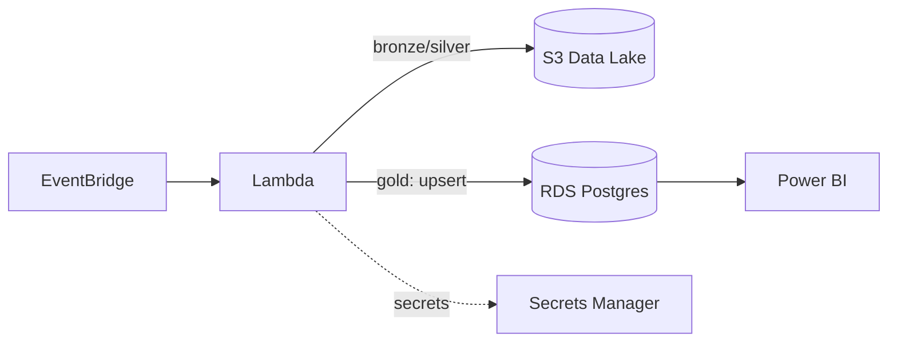

# Infrastructure as Code — Pipeline de Dados na Nuvem

Provisiona, via Terraform, a mesma lógica de negócio dos Projetos
01-03 (extração de qualidade do ar + agregação + classificação de AQI)
como uma arquitetura serverless na AWS: **S3** (data lake) + **Lambda**
(pipeline) + **RDS Postgres** (camada Gold, pronta para BI).

Projeto 04 de uma série de 6 documentando minha transição de Analista
de Dados para Engenharia/Arquitetura de Dados — veja o [perfil
completo](https://github.com/amanda-martins-data).

## Arquitetura



Decisões de arquitetura e trade-offs documentados em
[`docs/architecture.md`](docs/architecture.md) — incluindo um problema
real de rede (Lambda numa VPC sem NAT Gateway) que foi corrigido com
VPC Endpoints em vez do caminho mais caro/óbvio.

## Stack

`Terraform` · `AWS` (Lambda, S3, RDS, Secrets Manager, EventBridge, VPC Endpoints) · `Python` · `pytest`

## Estrutura

```
.
├── terraform/
│   ├── modules/pipeline/     # módulo reutilizável (25 recursos AWS)
│   └── environments/dev/     # ambiente dev, consumindo o módulo
├── src/
│   ├── lambda_handler.py     # orquestração (fala com AWS)
│   ├── extract.py            # extração real ou sintética
│   ├── transform.py          # agregação + AQI — Python puro, sem nuvem
│   └── load_rds.py           # upsert idempotente no Postgres
├── sql/schema.sql            # DDL da tabela gold
├── tests/test_transform.py   # testes da lógica pura (offline)
└── docs/architecture.md      # decisões e trade-offs
```

## Como rodar

**1. Testar a lógica de negócio (sem AWS, sem custo):**
```bash
pip install -r requirements.txt
python -m pytest tests/ -v
```

**2. Provisionar a infraestrutura (requer conta AWS):**
```bash
cd terraform/environments/dev
cp terraform.tfvars.example terraform.tfvars
# edite terraform.tfvars com o ARN da layer do psycopg2 para sua região
# (ver https://github.com/keithrozario/Klayers para ARNs públicos atualizados)

terraform init
terraform plan
terraform apply
```

**3. Bootstrap do schema (uma vez, após o apply):**
```bash
psql "$(terraform output -raw rds_endpoint)" -U pipeline_app -d air_quality -f ../../../sql/schema.sql
```

**4. Testar a Lambda manualmente:**
```bash
aws lambda invoke --function-name air-quality-pipeline-dev-pipeline out.json
cat out.json
```

## Validação

Sem conta AWS disponível neste ambiente, a validação seguiu duas
frentes (detalhes em `docs/architecture.md`):
- Terraform: sintaxe e estrutura validadas com `terraform-config-inspect`
  — 25 recursos, 5 data sources, 7 outputs, sem erros de parsing.
- Lógica de negócio: 5/5 testes `pytest` passando, cobrindo agregação,
  deduplicação de valores inválidos e as faixas de classificação AQI.

## Próximos passos do portfólio

- **Projeto 05** — pipeline com IA integrada.
- **Projeto 06** — observabilidade e testes de qualidade, estendidos
  também à infraestrutura (`terraform plan` em CI).
