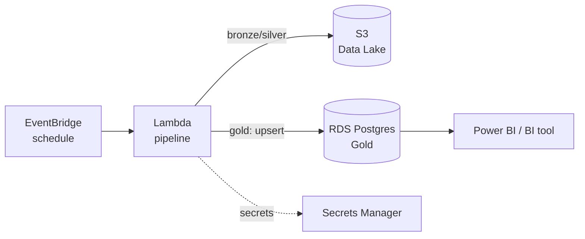

# Arquitetura — Pipeline de Dados como Código (Terraform)

## Visão geral

Evolução dos Projetos 01-03: a mesma lógica de extração e a mesma regra
de agregação/AQI viram uma função serverless, provisionada por
Terraform, com a camada Gold agora num banco gerenciado (RDS Postgres)
em vez de um arquivo local.

## Decisões e trade-offs

### 1. Serverless (Lambda) em vez de servidor sempre ligado
A carga é um job em lote diário — pagar por um servidor 24/7 para
rodar alguns segundos por dia não se justifica. Lambda cobra por
execução; o custo de infraestrutura de computação deste pipeline é,
na prática, próximo de zero.

### 2. Gold em RDS Postgres, não mais em Parquet
No Projeto 03, a camada Gold era um arquivo Parquet. Aqui vira uma
tabela num banco gerenciado — decisão deliberada: ferramentas de BI
(Power BI, Looker, Metabase) conectam nativamente em Postgres via
ODBC/JDBC, sem exigir que o analista de negócio saiba o que é Parquet
ou onde o arquivo está. A carga é um **upsert idempotente**
(`ON CONFLICT ... DO UPDATE`, ver `sql/schema.sql`): reprocessar o
mesmo dia atualiza os valores em vez de duplicar linhas.

### 3. Módulo Terraform reutilizável + ambiente fino
`terraform/modules/pipeline` não sabe que ambiente está rodando nele;
`terraform/environments/dev` só passa variáveis. Subir um ambiente
`staging` ou `prod` é criar uma nova pasta em `environments/` chamando
o mesmo módulo — sem duplicar a definição dos 25 recursos.

### 4. VPC Endpoints em vez de NAT Gateway
A Lambda precisa rodar dentro da VPC para alcançar o RDS de forma
privada — mas isso, por padrão, **corta o acesso dela à internet e às
APIs públicas da AWS** (S3, Secrets Manager). A solução mais comum é
um NAT Gateway (~US\$32/mês só de taxa fixa), mas para tráfego que é
*apenas* para outros serviços AWS, VPC Endpoints são mais baratos e
mais seguros (o tráfego nunca sai da rede da AWS):
- **S3**: Gateway Endpoint — gratuito.
- **Secrets Manager**: Interface Endpoint — custo pequeno por hora.

A API pública da OpenAQ continua inalcançável sem NAT — por isso
`openaq_use_synthetic = true` é o padrão: o pipeline funciona
completo, de ponta a ponta, sem precisar de um NAT Gateway pago. Trocar
para dados reais é uma decisão consciente de custo, documentada no
README, não uma surpresa na fatura.

### 5. psycopg2 via Lambda Layer, não empacotado no .zip
`psycopg2-binary` tem extensões compiladas em C; empacotar errado
(ex.: compilado num Mac, rodando numa Lambda Linux) é uma das causas
mais comuns de Lambda quebrada em produção. Usar uma Layer pública
correta para a arquitetura do Lambda remove essa classe de erro do
pacote de deploy, que fica pequeno e portátil.

### 6. Duas secrets separadas (API key vs. credenciais do banco)
Cada secret tem um único consumidor e um único ciclo de vida. Girar a
senha do banco não deveria exigir tocar na secret da API key da OpenAQ,
e vice-versa — secrets separadas tornam rotação e auditoria mais
simples do que uma secret "genérica" com tudo dentro.

### 7. Backend local do Terraform (e por que isso é uma limitação assumida)
Por padrão, o state fica em `terraform.tfstate` local — adequado para
uma pessoa rodando um projeto de portfólio, **não** para um time. Em
produção, isso seria um backend remoto (S3 + DynamoDB para lock), para
permitir colaboração e evitar dois `apply` simultâneos corromperem o
state. Documentado aqui em vez de escondido: o código já está
organizado para migrar o backend sem tocar nos módulos.

## Validação

Este ambiente não tem uma conta AWS configurada, então a validação
seguiu duas frentes, sem `terraform apply`:
- **Sintaxe/estrutura do Terraform**: validada com `terraform-config-inspect`
  (parsing completo dos módulos, sem erros — 25 recursos, 5 data
  sources, 7 outputs). Não substitui `terraform validate`/`plan` contra
  uma conta real, que é o próximo passo antes de um deploy de verdade.
- **Lógica de negócio (extração sintética + agregação + AQI)**: testada
  de verdade, localmente, com `pytest` — 5/5 testes passando. Essa é a
  parte do código que roda de fato independente de nuvem, e é onde bugs
  de lógica (não de infraestrutura) apareceriam.

## Riscos de segurança conhecidos (documentados, não escondidos)
- A senha do RDS (gerada via `random_password`) fica em texto plano no
  **Terraform state**. Com backend local isso é um arquivo na máquina
  de quem roda o `apply`; em produção, isso reforça a exigência de um
  backend remoto **criptografado** (S3 com SSE-KMS) e state nunca
  versionado em Git (por isso `*.tfstate` está no `.gitignore`).
- O Security Group da Lambda permite egress amplo (`0.0.0.0/0`) porque,
  com dados reais, ela precisa alcançar a OpenAQ (IP dinâmico, sem CIDR
  fixo). Isso é aceitável para egress (não é uma porta de entrada), mas
  seria revisado com uma lista de destinos mais estrita num ambiente
  com requisitos de compliance mais rígidos.

## Limitações conhecidas / próximos passos
- Sem NAT Gateway → modo `openaq_use_synthetic=false` (API real) não
  funciona nesta configuração sem adicionar essa peça (custo consciente,
  não implementado por padrão).
- Sem backend remoto de state (ver decisão 7).
- Sem CI de infraestrutura (`terraform plan` automático em PR) — ponto
  de partida natural para o **Projeto 06** (observabilidade/qualidade),
  aplicado também à infraestrutura, não só aos dados.
